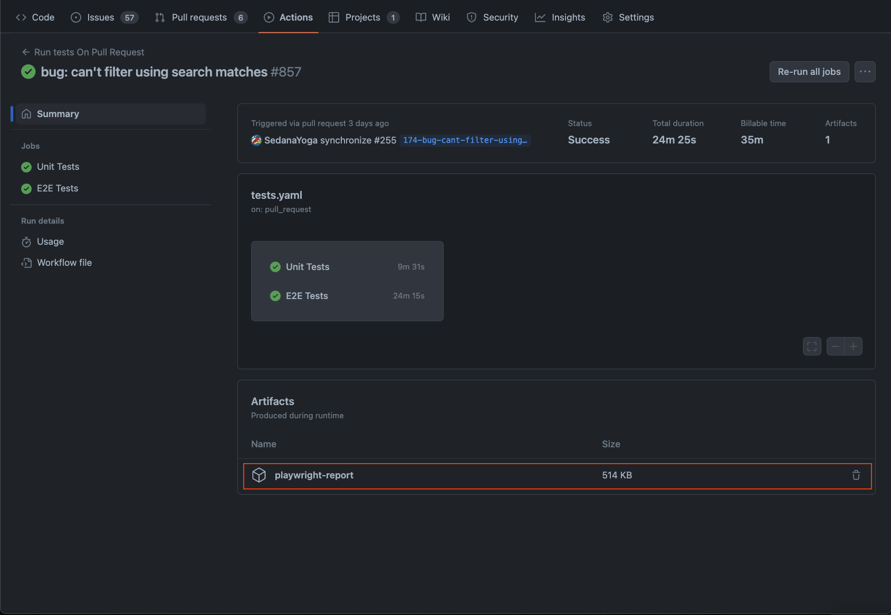
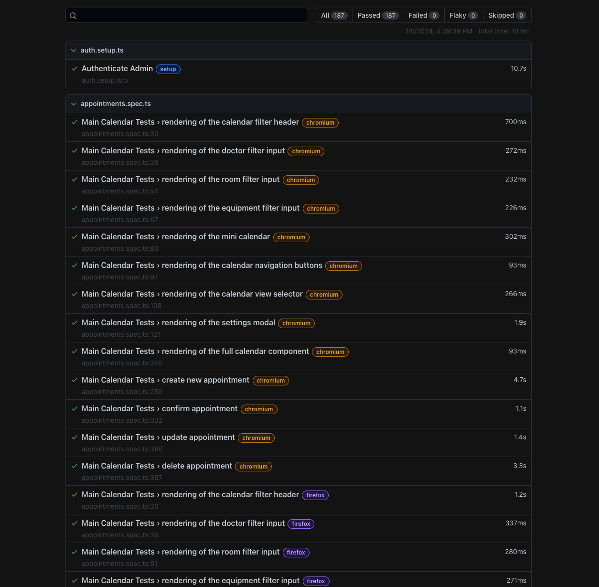

# Playwright

# Important!

1. Don’t use `retries` in playwright config

   ```ts
   // playwright.config.ts

   export default defineConfig({
   	...
   	retries: 0, // or don't set this flag as it's 0 by default
   	...
   })
   ```

2. If you find issue/error like

   ```tsx
   Test timeout of 30000ms exceeded.
   ```

   This message doesn’t mean anything, use this methods to find the root cause:

   - use `--headed` in CLI command and `await page.pause()` in your file to debug in certain line e.g. `npx playwright test --headed`
   - use `--debug` in CLI command to go fully on debug mode e.g. `npx playwright test --debug`
   - use `--trace on` in CLI command to generate test trace and you can see all steps in trace viewer, in CI you can set this option in config file under use.trace object e.g. `npx playwright test --trace on`
   - look at duration of steps you got from `npx playwright show-report` screen, if its more than 1.5s its probably an issue
   - If the error occurs in the CI, download trace file from GitHub action summary
     - Download trace file here
       
     - Then extract the downloaded file, after you get the folder
     - Run command `npx playwright show-report <PLAYWRIGHT-REPORT-DIR>`
     - You will have this UI in your browser `http://localhost:9323`
       
     - Then open the trace view to investigate the error

3. Use maximum worker in local and only 1 worker in CI to prioritize stability and reproducibility

   ```ts
   // playwright.config.ts

   export default defineConfig({
   	...
   	workers: process.env.CI ? 1 : undefined, // setting workers as undefined means using maximum worker that your machine can execute
   	...
   })
   ```

4. Don’t use `locator.click()` before `locator.fill()`, `locator.check()/uncheck()`, `locator.selectOption()` cause they can be done by itself, so no need to mimic user behavior cause that’s how playwright works, do `click()` on button, link, or tabs etc.
5. We should isolate our test case, use fixtures as what exactly the case of the flow, if the flow only happens on one page, make the page global so its being used in every tests. Otherwise if the flow needs to open different page, the context should be different too.

   ```ts
   import { expect, test } from '@playwright/test'
   import type { Page } from '@playwright/test'

   let page: Page

   test.beforeAll(async ({ browser }) => {
     page = await browser.newPage() // set page to global variable
     /* -----LOGIN STEPS----- */
   }

   test('Step 1', async () => {
   /* -----LOGIN STEPS----- */
      await page.... // page here comes from variable above
   })
   ```

6. Use test hooks to minimize duplicate code [https://playwright.dev/docs/writing-tests#using-test-hooks](https://playwright.dev/docs/writing-tests#using-test-hooks)
7. Use authentication if needed [https://playwright.dev/docs/auth](https://playwright.dev/docs/auth)
8. Use Web Assertion method ⇒ `await expect(<locator>).toBeVisible()` instead of `await locator.isVisible()`
9. There are 2 type of timeouts, test timeout and expect timeouts
   - Test Timeout by default 30 seconds that mean the test will be stopped immediately even though your test steps are not done yet, this is configurable in config file but keep in mind that this should affect resources as well
   - Expect timeout, this is the time to wait the expect assertion. Assertion fails when exceeding the timeout (most of the case for this is wrong locator definition)
10. Use page event to get data from network call (graphql response).

    ```vue
    // In page that you want to select the row/data by id from graphql response
    <template>
      ...
      <div :data-testid="<ID-FROM-GRAPHQL>">
        <u-button
          color="gray"
          variant="ghost"
          icon="i-ph-dots-three-outline-duotone"
        />
      </div>
      ...
    </template>
    ```

    ```ts
    import { expect, test } from '@playwright/test'
    import { faker } from '@faker-js/faker'
    import type { Page, Response } from '@playwright/test'

    let createdDoctorId: string

    const createDoctorListener = async (response: Response) => {
      const isValidResponse = response?.request()?.postDataJSON()?.operationName === 'createEntity'
      if (createdDoctorId || !isValidResponse) return
      const json = await response.json()
      createdDoctorId = json ? json.data?.createEntity?.id : ''
    }

    test.describe.serial('Doctor Appointment Schedule', () => {
      test.beforeAll(async ({ browser }) => {
    		...
    		page.on('response', createDoctorListener)
    		...
    		page.off('response', createDoctorListener)
    	})
    })
    ...
    test('Doctor', async () => {
    	...
    	const testDataThreeDots = page.getByTestId(createdDoctorId)
    	await testDataThreeDots.click()
    	...
    })
    ...
    ```
11. The safest way of using locator is by using `getByTestId` method
    ```ts
    const emailSubject = page.getByTestId('email-subject')
    ```
12. Save the locator inside a variable, avoid using locator right in the test step e.g. `await page.getTestById('save-button').click()`, by defining the locator as a variable e.g. `const saveButton = page.getByTestId('save-button')`, not only it's cleaner, it also give you capability to reuse it.
13. For consistency, please write the tests with more readable order. The variable definitions should be on the top of each tests, then follows with steps below. This way you should be able to debug easier cause the steps are grouped and we can just focus on what we want to track.
    ```ts
    test('Delete', async () => {
       const doctorSideBarMenu = page.getByTestId('Doctors-sidebar-menu')
       const loading = page.locator('div').filter({ hasText: 'Loading...' })
       const testDataThreeDot = page.getByTestId(createdDoctorId)
       const deleteButton = page.getByRole('menuitem', { name: 'Delete', exact: true }).first()
       const confirmDeleteText = page.getByText('Are you sure you want to delete')
       const confirmDeleteButton = page.getByRole('button', { name: 'Yes', exact: true }).first()
       const successMessage = page.getByText('Doctor deleted successfully')
   
       await doctorSideBarMenu.click()
       await testDataThreeDot.click()
       await expect(deleteButton).toBeVisible()
       await deleteButton.click()
       await expect(confirmDeleteText).toBeVisible()
       await expect(confirmDeleteButton).toBeVisible()
       await confirmDeleteButton.click()
       await expect(successMessage).toBeVisible()
       await expect(loading).toHaveCount(0)
     })
    ```
14. Don't run the tests when the backend is deploying, it can interrupt your tests especially if it's the auth service. There is a big possibility that the access token is reset by the backend.
15. Feel free to cancel the e2e test progress in the CI if you know it won't be passed. For example, you know the commit that you push will trigger the test run with failing test (might me in another module but you are 100% sure it won't work). This way, not only you save your time, you save the billable time of Github Actions.

# Testing Philosophy

## Test user-visible behavior

The end user will see or interact with what is rendered on the page, so your test should typically only see/interact with the same rendered output. Avoid relying on things which user will not use, see, or know like function, array, or the CSS.

## Make tests as isolated as possible

Each test should be completely isolated from another test and should run independently with its own local storage, session storage, data, cookies etc.

In order to avoid repetition for a particular part of your test you can use [before and after hooks](https://playwright.dev/docs/api/class-test).

```ts
import { test } from "@playwright/test";

test.beforeEach(async ({ page }) => {
  // Runs before each test and signs in each page.
  await page.goto("https://github.com/login");
  await page.getByLabel("Username or email address").fill("username");
  await page.getByLabel("Password").fill("password");
  await page.getByRole("button", { name: "Sign in" }).click();
});

test("first", async ({ page }) => {
  // page is signed in.
  await page.goto("/doctors");
  await expect(page.getByText("Welcome")).toBeVisible();
});

test("second", async ({ page }) => {
  // page is signed in.
});
```

You can also reuse the signed-in state in the tests with [setup project](https://playwright.dev/docs/auth#basic-shared-account-in-all-tests). That way you can log in only once and then skip the log in step for all of the tests.

## Avoid testing third-party dependencies

Don't try to test links to external sites or third party servers that you do not control.

Instead, use the [Playwright Network API](https://playwright.dev/docs/network#handle-requests) and guarantee the response needed.

## **Testing with a database[](https://playwright.dev/docs/best-practices#testing-with-a-database)**

If working with a database then make sure you control the data. Test against a staging environment and make sure it doesn't change. For visual regression tests make sure the operating system and browser versions are the same.

# Best Practices

## Use Locators

Locators come with auto waiting and retry-ability. **Auto waiting means that Playwright performs a range of actionability checks on the elements, such as ensuring the element is visible and enabled before it performs the click.**

**To make tests resilient, we recommend prioritizing user-facing attributes and explicit contracts.**

```ts
page.getByRole("button", { name: "submit" });
```

### Use chaining and filtering

Locators can be [chained](https://playwright.dev/docs/locators#matching-inside-a-locator) to narrow down the search to a particular part of the page.

```ts
const product = page.getByRole("listitem").filter({ hasText: "Product 2" });
```

You can also [filter locators](https://playwright.dev/docs/locators#filtering-locators) by text or by another locator.

```ts
await page
  .getByRole("listitem", { name: "Add Item" })
  .filter({ hasText: "Product 2" })
  .getByRole("button", { name: "Add to cart" })
  .click();
```

### **Prefer user-facing attributes to XPath or CSS selectors**

DOM can easily change so having your tests depend on your DOM structure can lead to failing tests.

```ts
// DON'T!
page.locator("button.buttonIcon.episode-actions-later");
```

```ts
// DO!
page.getByRole("button", { name: "submit" });
```

## Generate locators

### Use codegen to generate locators

Not very useful to be honest

## **Use web first assertions**

By using [web first assertions](https://playwright.dev/docs/test-assertions) **Playwright will wait until the expected condition is met**. For example, when testing an alert message, a test would click a button that makes a message appear and check that the alert message is there. If the alert message takes half a second to appear, assertions such as `toBeVisible()` will wait and retry if needed.

### **Don't use manual assertions**

Don't use manual assertions that are not awaiting the expect. When using assertions such as `isVisible()` the test won't wait a single second, it will just check the locator is there and return immediately.

```ts
// 👎
await page.getByText("welcome").isVisible();
```

### Use web first assertion instead

```ts
// 👍
await expect(page.getByText("welcome")).toBeVisible();
```

## Configure debugging

### **Local debugging**

- Debug with VSCode
- Debug with Playwright Inspector
  ```bash
  npx playwright test --debug
  ```

### Debugging on CI

**For CI failures, use the Playwright [trace viewer](https://playwright.dev/docs/trace-viewer) instead of videos and screenshots.**

Traces are configured in the Playwright config file and are set to run on CI on the first retry of a failed test. We don't recommend setting this to `on` so that traces are run on every test as it's very performance heavy. However you can run a trace locally when developing with the `--trace` flag.

```bash
npx playwright test --trace on
```

Once you run this command your traces will be recorded for each test and can be viewed directly from the HTML report.

```bash
npx playwright show-report
```

Traces can be opened by clicking on the icon next to the test or by opening each of the test reports and scrolling down to the traces section.

## Test across all browsers

In your config file you can set up projects adding the name and which browser or device to use.

## **Keep your Playwright dependency up to date**

By keeping your Playwright version up to date you will be able to test your app on the latest browser versions and catch failures before the latest browser version is released to the public.

```bash
npm install -D @playwright/test@latest
```

## Run tests on CI

Playwright comes with a [GitHub actions workflow](https://playwright.dev/docs/ci-intro) so that tests will run on CI for you with no setup required. Playwright can also be setup on the [CI environment](https://playwright.dev/docs/ci) of your choice.

Use Linux when running your tests on CI as it is cheaper. Developers can use whatever environment when running locally but use linux on CI.

## Lint your tests

Linting the tests helps catching errors early. Use `[@typescript-eslint/no-floating-promises](https://typescript-eslint.io/rules/no-floating-promises/)` [ESLint](https://eslint.org/) rule to make sure there are no missing awaits before the asynchronous calls to the Playwright API.

## Use parallelism and sharding

Playwright runs tests in [parallel](https://playwright.dev/docs/test-parallel) by default. Tests in a single file are run in order, in the same worker process. If you have many independent tests in a single file, you might want to run them in parallel.

```ts
import { test } from "@playwright/test";

test.describe.configure({ mode: "parallel" });

test("runs in parallel 1", async ({ page }) => {
  /* ... */
});
test("runs in parallel 2", async ({ page }) => {
  /* ... */
});
```

# Productivity tips

## Use Soft assertions

These do not immediately terminate the test execution, but rather compile and display a list of failed assertions once the test ended.

```ts
// Make a few checks that will not stop the test when failed...
await expect.soft(page.getByTestId("status")).toHaveText("Success");

// ... and continue the test to check more things.
await page.getByRole("link", { name: "next page" }).click();
```

